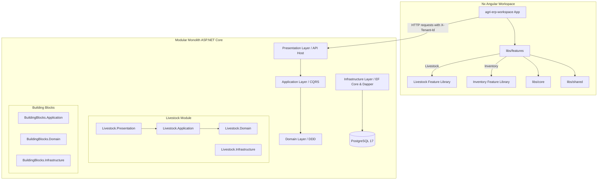

# AgriErpWorkspace

<a alt="Nx logo" href="https://nx.dev" target="_blank" rel="noreferrer"></a>

✨ Your new, shiny [Nx workspace](https://nx.dev) is ready ✨.

[Learn more about this workspace setup and its capabilities](https://nx.dev/getting-started/tutorials/angular-standalone-tutorial?utm_source=nx_project&amp;utm_medium=readme&amp;utm_campaign=nx_projects) or run `npx nx graph` to visually explore what was created. Now, let's get you up to speed!

## Run tasks

To run the dev server for your app, use:

```sh
npx nx serve agri-erp-workspace
```

To create a production bundle:

```sh
npx nx build agri-erp-workspace
```

To see all available targets to run for a project, run:

```sh
npx nx show project agri-erp-workspace
```

These targets are either [inferred automatically](https://nx.dev/concepts/inferred-tasks?utm_source=nx_project&utm_medium=readme&utm_campaign=nx_projects) or defined in the `project.json` or `package.json` files.

[More about running tasks in the docs &raquo;](https://nx.dev/features/run-tasks?utm_source=nx_project&utm_medium=readme&utm_campaign=nx_projects)

## Add new projects

While you could add new projects to your workspace manually, you might want to leverage [Nx plugins](https://nx.dev/concepts/nx-plugins?utm_source=nx_project&utm_medium=readme&utm_campaign=nx_projects) and their [code generation](https://nx.dev/features/generate-code?utm_source=nx_project&utm_medium=readme&utm_campaign=nx_projects) feature.

Use the plugin's generator to create new projects.

To generate a new application, use:

```sh
npx nx g @nx/angular:app demo
```

To generate a new library, use:

```sh
npx nx g @nx/angular:lib mylib
```

You can use `npx nx list` to get a list of installed plugins. Then, run `npx nx list <plugin-name>` to learn about more specific capabilities of a particular plugin. Alternatively, [install Nx Console](https://nx.dev/getting-started/editor-setup?utm_source=nx_project&utm_medium=readme&utm_campaign=nx_projects) to browse plugins and generators in your IDE.

[Learn more about Nx plugins &raquo;](https://nx.dev/concepts/nx-plugins?utm_source=nx_project&utm_medium=readme&utm_campaign=nx_projects) | [Browse the plugin registry &raquo;](https://nx.dev/plugin-registry?utm_source=nx_project&utm_medium=readme&utm_campaign=nx_projects)

## Set up CI!

### Step 1

To connect to Nx Cloud, run the following command:

```sh
npx nx connect
```

Connecting to Nx Cloud ensures a [fast and scalable CI](https://nx.dev/ci/intro/why-nx-cloud?utm_source=nx_project&utm_medium=readme&utm_campaign=nx_projects) pipeline. It includes features such as:

- [Remote caching](https://nx.dev/ci/features/remote-cache?utm_source=nx_project&utm_medium=readme&utm_campaign=nx_projects)
- [Task distribution across multiple machines](https://nx.dev/ci/features/distribute-task-execution?utm_source=nx_project&utm_medium=readme&utm_campaign=nx_projects)
- [Automated e2e test splitting](https://nx.dev/ci/features/split-e2e-tasks?utm_source=nx_project&utm_medium=readme&utm_campaign=nx_projects)
- [Task flakiness detection and rerunning](https://nx.dev/ci/features/flaky-tasks?utm_source=nx_project&utm_medium=readme&utm_campaign=nx_projects)

### Step 2

Use the following command to configure a CI workflow for your workspace:

```sh
npx nx g ci-workflow
```

[Learn more about Nx on CI](https://nx.dev/ci/intro/ci-with-nx#ready-get-started-with-your-provider?utm_source=nx_project&utm_medium=readme&utm_campaign=nx_projects)

## Install Nx Console

Nx Console is an editor extension that enriches your developer experience. It lets you run tasks, generate code, and improves code autocompletion in your IDE. It is available for VSCode and IntelliJ.

[Install Nx Console &raquo;](https://nx.dev/getting-started/editor-setup?utm_source=nx_project&utm_medium=readme&utm_campaign=nx_projects)

## Useful links

Learn more:

- [Learn more about this workspace setup](https://nx.dev/getting-started/tutorials/angular-standalone-tutorial?utm_source=nx_project&amp;utm_medium=readme&amp;utm_campaign=nx_projects)
- [Learn about Nx on CI](https://nx.dev/ci/intro/ci-with-nx?utm_source=nx_project&utm_medium=readme&utm_campaign=nx_projects)
- [Releasing Packages with Nx release](https://nx.dev/features/manage-releases?utm_source=nx_project&utm_medium=readme&utm_campaign=nx_projects)
- [What are Nx plugins?](https://nx.dev/concepts/nx-plugins?utm_source=nx_project&utm_medium=readme&utm_campaign=nx_projects)

And join the Nx community:
- [Discord](https://go.nx.dev/community)
- [Follow us on X](https://twitter.com/nxdevtools) or [LinkedIn](https://www.linkedin.com/company/nrwl)
- [Our Youtube channel](https://www.youtube.com/@nxdevtools)
- [Our blog](https://nx.dev/blog?utm_source=nx_project&utm_medium=readme&utm_campaign=nx_projects)
# AgriERP 🌾🚜

[](https://dotnet.microsoft.com/)
[](https://angular.dev/)
[](https://nx.dev/)
[](https://www.postgresql.org/)
[](LICENSE)

**AgriERP** is a modern, enterprise-grade Agriculture Resource Planning system designed to streamline and automate complex farm and agricultural operations. Built using a **Modular Monolith** architecture with **Domain-Driven Design (DDD)** on the backend and a structured **Nx Monorepo with Angular 21** on the frontend, it provides a highly scalable, secure, and multi-tenant solution for modern agricultural businesses.

---

## 🏗️ Architecture Overview

The system is designed with scalability, modularity, and clean separation of concerns in mind.



### 🧠 Backend Highlights
*   **Modular Monolith**: Separated by independent modules (e.g., Livestock) that communicate via clean API interfaces or domain events, keeping the codebase easy to maintain and refactor into microservices if needed in the future.
*   **Domain-Driven Design (DDD)**: Core domain concepts are encapsulated inside entities and aggregates (`AggregateRoot`, `Entity`, `IMultiTenant`) implementing business-centric rules.
*   **CQRS (Command Query Responsibility Segregation)**:
    *   **Writes (Commands)**: Handled by **Entity Framework Core** for rich business logic, validation, and change tracking.
    *   **Reads (Queries)**: Handled by **Dapper** with raw, high-performance SQL query mappings.
*   **Multi-Tenancy (SaaS)**:
    *   Row-level isolation using a global `TenantId` discriminator.
    *   Tenant resolution via `HttpTenantProvider` based on JWT claims (e.g., Keycloak token payloads) or fallback `X-Tenant-Id` HTTP headers.
    *   Automatic EF Core Query Filters apply `TenantId` scope dynamically to all queries.
    *   Safety checks intercept database updates and block operations modifying other tenants' data.
*   **Pipeline Behaviors**:
    *   Automatic validation using **FluentValidation** executed inside **MediatR Pipeline Behaviors** before hitting business handlers.
*   **Global Exception Handling**: Converts exceptions like validation failures to RFC-7807 compliant Problem Details responses.
*   **Architecture Testing**: Integrated **NetArchTest** suite ensures structural rules remain unviolated (e.g., ensuring the Domain layer has no database or third-party persistence framework dependencies).

### 🎨 Frontend Highlights
*   **Nx Monorepo Workspace**: Organizes the frontend application and components into reusable, self-contained libraries.
*   **Angular 21 & Standalone Components**: Built using the modern features of Angular including standalone components, typed routing, and clean dependency management.
*   **PrimeNG & PrimeIcons**: Leverages the enterprise component library PrimeNG v21 for slick, dark-themed responsive dashboards.
*   **Modular Libraries**: Divided logically into:
    *   `core`: Global singleton services (auth, API clients, state management).
    *   `features`: Feature-specific modules like `livestock` and `inventory`.
    *   `shared`: Reusable UI components, directives, and pipes.

---

## 🛠️ Technology Stack

| Category | Technology / Library | Description |
| :--- | :--- | :--- |
| **Backend Framework** | .NET 9.0 / ASP.NET Core | Cross-platform, high-performance web API framework |
| **Database ORM/Query**| Entity Framework Core & Dapper | CQRS architecture (EF Core for Writes, Dapper for fast Reads) |
| **Database** | PostgreSQL 17 | Advanced open-source relational database |
| **Command Pattern** | MediatR | In-process messaging for CQRS commands and queries |
| **Validation** | FluentValidation | Strongly-typed validation rules for API inputs |
| **Architecture Tests** | NetArchTest.eXtreme / xUnit | Verification of clean architecture boundary rules |
| **Frontend Framework** | Angular 21 | Modern SPA framework utilizing Standalone Components |
| **Monorepo Tools** | Nx Workspace v23 | Smart, fast, extensible monorepo tooling |
| **UI Components** | PrimeNG v21 | Enterprise UI component library for Angular |
| **DevOps / Containers**| Docker & Docker Compose | Containerized local PostgreSQL database setup |

---

## 📂 Project Structure

```text
AgriERP/
├── Backend/                                # ASP.NET Core Web API Monolith
│   ├── src/
│   │   ├── BuildingBlocks/                 # Core shared architectural building blocks
│   │   │   ├── AgriERP.BuildingBlocks.Domain/       # Aggregate base, Entity base, Tenant interface
│   │   │   ├── AgriERP.BuildingBlocks.Application/  # MediatR validation pipeline behaviors, Tenant Provider interface
│   │   │   └── AgriERP.BuildingBlocks.Infrastructure/ # HTTP context Tenant accessor, DB tenant intercepts
│   │   └── Livestock/                      # Livestock Module
│   │       ├── AgriERP.Modules.Livestock.Domain/      # Animal aggregates, Enums, factory methods
│   │       ├── AgriERP.Modules.Livestock.Application/ # Register & Fetch query handlers (CQRS)
│   │       ├── AgriERP.Modules.Livestock.Infrastructure/# DbContext setup, migrations
│   │       └── AgriERP.Modules.Livestock.Presentation/ # API controllers, Host startup (Program.cs)
│   ├── tests/
│   │   └── AgriERP.Architecture.Tests      # Structural boundary tests using NetArchTest
│   └── AgriERP.slnx                        # Solution configuration
├── Frontend/                               # Nx Monorepo Frontend Workspace
│   └── agri-erp-workspace/
│       ├── apps/agri-erp-workspace/        # Standalone Angular App entry point
│       ├── libs/
│       │   ├── core/                       # Core services (authentication, routing)
│       │   ├── features/                   # Features (livestock, inventory component libs)
│       │   └── shared/                     # Reusable UI controls and styling
│       ├── package.json
│       └── nx.json
├── docker-compose.yml                      # Infrastructure container setup (PostgreSQL 17)
└── README.md                               # Project documentation
```

---

## 🚀 Getting Started

Follow these steps to run the complete solution locally.

### 📋 Prerequisites
Ensure you have the following installed on your machine:
*   [.NET 9.0 SDK](https://dotnet.microsoft.com/download/dotnet/9.0)
*   [Node.js (v18+) & npm](https://nodejs.org/)
*   [Docker Desktop](https://www.docker.com/products/docker-desktop/)

---

### 🗄️ Step 1: Start the Database

A PostgreSQL database configuration is provided in the root `docker-compose.yml`. Start the container using:

```bash
docker-compose up -d
```

This starts a Postgres instance accessible at:
*   **Host**: `localhost:5432`
*   **Database**: `AgriErpDb`
*   **User**: `agri_admin`
*   **Password**: `SecretPassword123!`

---

### 🖥️ Step 2: Set Up and Run the Backend API

1.  Navigate to the Livestock Presentation folder:
    ```bash
    cd Backend/src/Livestock/AgriERP.Modules.Livestock.Presentation
    ```
2.  Update your `appsettings.json` if required (default connections map directly to the docker-compose credentials).
3.  Apply EF Core migrations to initialize the database schema:
    ```bash
    dotnet ef database update
    ```
4.  Run the API:
    ```bash
    dotnet run
    ```
5.  Open [https://localhost:7196/swagger](https://localhost:7196/swagger) in your browser to view the interactive **Swagger / OpenAPI Documentation**.

---

### 🌐 Step 3: Run the Angular Frontend

1.  Navigate to the workspace directory:
    ```bash
    cd Frontend/agri-erp-workspace
    ```
2.  Install dependencies:
    ```bash
    npm install
    ```
3.  Launch the development server:
    ```bash
    npx nx serve agri-erp-workspace
    ```
4.  Open [http://localhost:4200](http://localhost:4200) to view the application.

---

## 📡 Core API Endpoints

All requests require the `X-Tenant-Id` header (e.g., `X-Tenant-Id: 3fa85f64-5717-4562-b3fc-2c963f66afa6`) to distinguish tenant context.

### 1. Register a New Animal
*   **URL**: `/api/v1/livestock/animals`
*   **Method**: `POST`
*   **Request Body**:
    ```json
    {
      "tagNumber": "ANML-90812-TX",
      "species": "Cattle",
      "purpose": 1, 
      "dateOfBirth": "2024-03-12T00:00:00Z",
      "initialWeight": 320.5
    }
    ```
*   **Response (201 Created)**:
    ```json
    {
      "id": "e0b04c86-13a8-444f-9a74-d4b99824ff7d"
    }
    ```

### 2. Fetch Animals list
*   **URL**: `/api/v1/livestock/animals`
*   **Method**: `GET`
*   **Response (200 OK)**:
    ```json
    [
      {
        "id": "e0b04c86-13a8-444f-9a74-d4b99824ff7d",
        "tagNumber": "ANML-90812-TX",
        "species": "Cattle",
        "purpose": "Fattening",
        "status": "Active",
        "currentWeight": 320.5,
        "dateOfBirth": "2024-03-12T00:00:00Z"
      }
    ]
    ```

---

## 🧪 Testing

### Backend Architecture and Code Rules
Architecture rules are enforced using **NetArchTest** to keep modules separated. Run all tests with:
```bash
cd Backend
dotnet test
```

### Frontend unit tests
Run unit tests across the Nx workspace using:
```bash
cd Frontend/agri-erp-workspace
npx nx run-many -t test
```

---

## 📄 License
This project is licensed under the MIT License. See the [LICENSE](LICENSE) file for details.
